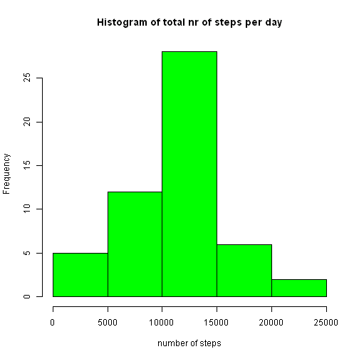
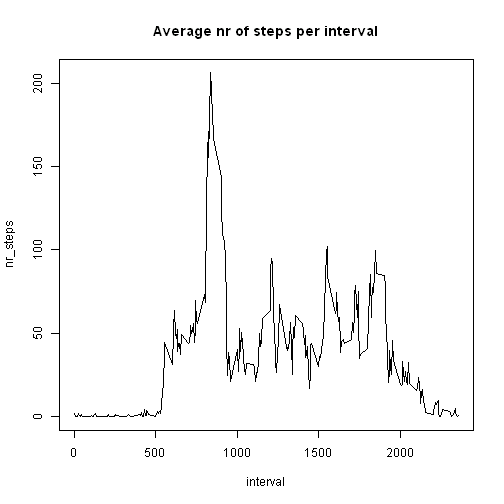
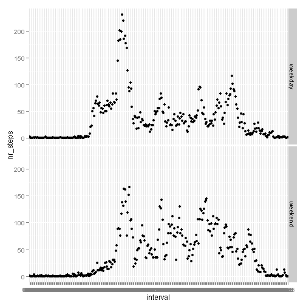

## Loading and preprocessing the data
First the dataset is loaded and cleaned up:

```r
my_data <-
      read.csv("activity.csv", sep=",", na.strings = "NA") %>%
      tbl_df() %>%
      mutate(date = ymd(date)) %>%
      mutate(interval = sprintf("%04.0f", interval)) %>%
      mutate(hour = hour(parse_date_time(interval, ("hm")))) %>%
      mutate(min = minute(parse_date_time(interval, ("hm")))) %>%
      mutate(time = paste(hour,min, sep =':')) %>%
      mutate(date_time = paste(date, time, sep = '_')) %>%
      mutate(date_time = ymd_hm(date_time)) %>%
      select(-hour, -min, -time) 
```

## Mean total number of steps taken per day
The first task is to answer the following questions:

* Make a histogram of the total number of steps taken each day
* Calculate and report the mean and median of the total number of steps taken per day


First we calculate the total number of steps per day:

```r
steps_day_total <- my_data %>%
      filter(complete.cases(.)) %>%
      group_by(date) %>%
      summarise(nr_steps = sum(steps))
```

Then we can use these totals and put them in a histogram:

```r
with(steps_day_total,
     hist(nr_steps,
          xlab = 'number of steps',
          main = 'Histogram of total nr of steps per day',
          col = 'green'
          )
     )
```

 

Finally, we calculate both the mean and median of the steps taken each day:

```r
mean_steps <- mean(steps_day_total$nr_steps)
median_steps <- median(steps_day_total$nr_steps)
```

The mean number of steps is 1.0766189 &times; 10<sup>4</sup>.  
The median number of steps is 10765.  

## Average daily activity pattern
Here we need to answer the following questions:

* make a graph of the average nr of steps per interval
* identify the interval with the maximum number of average steps

First we calculate the average number of step for each 5-minute interval:

```r
steps_interval_avg <- my_data %>%
      filter(complete.cases(.)) %>%
      group_by(interval) %>%
      summarise(nr_steps = mean(steps))
```

Then we make a graph:

```r
with(steps_interval_avg,
     plot(interval,
          nr_steps,
          main = 'Average nr of steps per interval',
          type = 'l'
     )
)
```

 

Finally we identify the interval with the most activity:

```r
max_avg_step_int <- steps_interval_avg %>%
      with(.,
           interval[nr_steps == max(.$nr_steps)]
           )
```
The interval with the maximum average ammount of steps is 0835.

## Imputing missing values
The original dataset contains a number of missing (NA) values.  
These are further investigated in this section and a possible solution is suggested and applied.  
  
The questions to be answered:

* Calculate and report the total number of missing values
* Devise a strategy for filling in all of the missing values in the dataset
* Create a new dataset that is equal to the original dataset but with the missing data filled in
* Make a histogram of the total number of steps taken each day
* Report the mean and median total number of steps taken per day
* Analyse the impact of filling in the missing values

First we calculate the number of missing values:

```r
nr_missing <- sum(!complete.cases(my_data))
```
There are 2304 lines containing missing values in the original dataset.

To solve the problem of missing values, We will assign the average number of steps of each corresponding period as calculated in the previous step.

```r
my_data_missing <- my_data %>%
      filter(!complete.cases(.)) %>%
      left_join(steps_interval_avg) %>%
      mutate(steps = nr_steps) %>%
      select(steps, date, interval, date_time)
```

Once this is done, we can take the original dataset and add the lines to which we assigned the average values.

```r
my_data_complete <- my_data %>%
      filter(complete.cases(.)) %>%
      rbind_list(., my_data_missing) %>%
      arrange(date_time)
```

First we recalculate the total number of steps per day, but now with the completed dataset:

```r
steps_day_total2 <- my_data %>%
      filter(complete.cases(.)) %>%
      group_by(date) %>%
      summarise(nr_steps = sum(steps))
```

Then we can make a histogram of total steps per day:

```r
with(steps_day_total2,
     hist(nr_steps,
          xlab = 'number of steps',
          main = 'Histogram of total nr of steps per day after correcting for missing values',
          col = 'green'
     )
)
```

 

Finally we identify the interval with the most activity:

```r
mean_steps2 <- mean(steps_day_total2$nr_steps)
median_steps2 <- median(steps_day_total2$nr_steps)
```

The revised mean number of steps is 1.0766189 &times; 10<sup>4</sup>.  
The revised median number of steps is 10765.  

### Impact analysis
The difference between both mean values is 0.  
The difference between both median values is 0.  

## Differences in activity patterns between weekdays and weekends
Finally we need to investigate the difference in activity pattern in the week versus the week-end.  
  
First, we make a dataframe that identifies which days are weekdays and which das are week-end days:

```r
days <- data.frame(
      c('Monday','Tuesday','Wednesday','Thursday','Friday','Saturday','Sunday'),
      c(rep('weekday', each=5),rep('weekend', each=2))
      ) %>%
      tbl_df()

colnames(days) <- c('day_name', 'day_type')
```

Then we join this dataframe with our original dataframe:

```r
my_data_complete <- my_data_complete %>%
      mutate(day_name = weekdays(date)) %>%
      left_join(days) %>%
      select(-day_name)
```

With our updated dateset, we make a panel plot showing the average number of steps per interval for both the week and the week-end.

```r
my_data_complete %>%
      group_by(interval, day_type) %>%
      summarise(nr_steps = mean(steps)) %>%
      qplot(interval,
            nr_steps,
            data = .,
            facets = day_type~.,
            )
```

 

